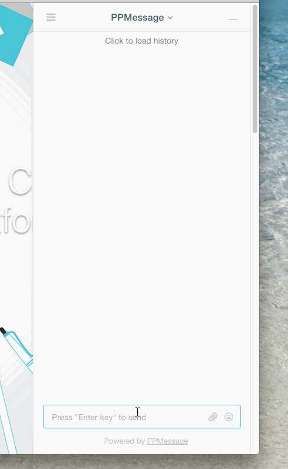
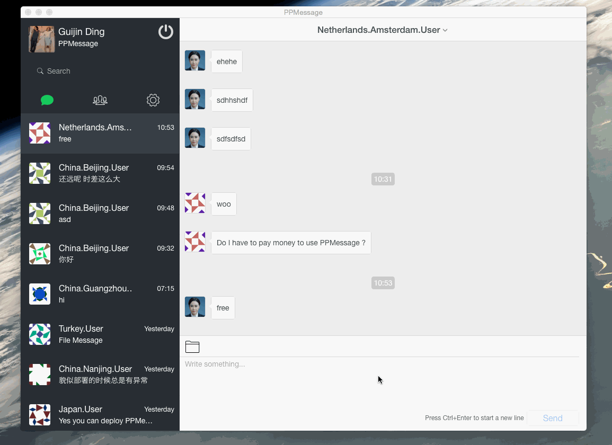

<!-- Customer             |  Service -->
<!-- :-------------------------:|:-------------------------: -->
<!--   |  -->

</img>


# PPMessage

With PPMessage, you can chat with visitor or customer via Web or mobile App as open source [Intercom](http://intercom.io) alternative.

PPMessage targets to run on Linux, macOS and even **Windows** operating systems. PPMessage includes a clearly API system which could be integrated with any open source Content Management System like Wordpress, Drupal and any commercial system even an e-commerce system.

PPMessage includes a series of frontend SDK named **PPCom** which run on your visitor or customer side, and a series of frontend App named **PPKefu** which run on your service team side.

**PPConsole** is Web admin interface of PPMessage and open sourced as well. After PPMessage backend running, PPConsole provided a Web interface to manager the PPMessage system. 

**PPConfig** is the first web UI you may meet. If you want run a PPMessage server from source, PPMessage will guide to config itself at first.


## SUBPROJECTS

* [PPCom iOS SDK](https://github.com/PPMESSAGE/ppcom-ios-sdk)

* [PPCom Android SDK](https://github.com/PPMESSAGE/ppcom-android-sdk)


## EASY START

> Clone

```bash
git clone https://github.com/PPMESSAGE/ppmessage.git
cd ppmessage
```

> Under Debian/Ubuntu


```bash
bash ppmessage/scripts/set-up-ppmessage-on-linux.sh
```

> Under macOS


```bash
bash ppmessage/scripts/set-up-ppmessage-on-mac.sh
```

> Under Windows


Check [this](ppmessage/doc/en-us/install-ppmessage-on-windows.md)


> Run and check log

```bash
./ppmessage.py
```

> Access


```bash
Open your browser to access `http://127.0.0.1:8945`, watch the log of `ppmessage.py` to use your URL.

```


> Not working yet? Please file an issue on Github, thanks. Enjoy!

## DOCUMENTS

> In the following, list some document to use and develope PPMessage. More on [PPMessage Site](https://ppmessage.com).

* [Complete english manual](https://ppmessage.gitbooks.io/ppbook-en/content/)


## LICENSE 

> Please read license carefully, you can use it freely, but not cross the license.

[Apache License Version 2.0](http://www.apache.org/licenses/LICENSE-2.0)

Copyright (c) 2010-2016, PPMESSAGE team and contributors - https://www.ppmessage.com and https://github.com/PPMESSAGE/ppmessage

Licensed under the Apache License, Version 2.0 (the "License");
you may not use this file except in compliance with the License.
You may obtain a copy of the License at

    http://www.apache.org/licenses/LICENSE-2.0

Unless required by applicable law or agreed to in writing, software
distributed under the License is distributed on an "AS IS" BASIS,
WITHOUT WARRANTIES OR CONDITIONS OF ANY KIND, either express or implied.
See the License for the specific language governing permissions and
limitations under the License.


## OTHER LANGUAGES

[In Chinese 中文版](ppmessage/doc/zh-cn/README.md)
